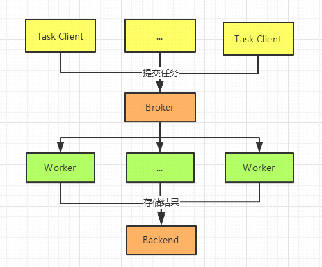

# 1 celery 入门
- celery是一个简单，灵活、可靠的分布式任务执行框架，可以支持大量任务的并发执行。celery采用典型生产者和消费者模型。生产者提交任务到任务队列，众多消费者从任务队列中取任务执行。
## 1.1 celery架构
-    Celery由以下三部分构成：消息中间件(Broker)、任务执行单元Worker、结果存储(Backend)
    
-  执行流程
   ```
    任务调用提交任务执行请求给Broker队列
    如果是异步任务，worker会立即从队列中取出任务并执行，执行结果保存在Backend中
    如果是定时任务，任务由Celery Beat进程周期性地将任务发往Broker队列，Worker实时监视消息队列获取队列中的任务执行

   ```
## 1.2 Celeryd简单开发实例
- celery的应用开发涉及四个部分
  ```
    celery 实例初始化
    任务的定义（定时和实时任务）
    任务worker的启动
    任务的调用
  ```
### 1.2.1 项目目录demo
```textmate
# 项目目录
celery_chuji
.
├── config.py
├── __init__.py
├── period_task.py
└── tasks.py
```
### 1.2.2 celery 实例初始化
    celery的实例化，主要包括执行Broker和backend的访问方式，任务模块的申明等

```python
# celery 实例初始化 
# __init__.py
from celery import Celery
app = Celery('wedo')  # 创建 Celery 实例
app.config_from_object('wedo.config') 

# 配置config
# config.py
BROKER_URL = 'redis://10.8.238.2:6379/0' # Broker配置，使用Redis作为消息中间件
CELERY_RESULT_BACKEND = 'redis://10.8.238.2:6379/0' # BACKEND配置，这里使用redis
CELERY_RESULT_SERIALIZER = 'json' # 结果序列化方案
CELERY_TASK_RESULT_EXPIRES = 60 * 60 * 24 # 任务过期时间
CELERY_TIMEZONE='Asia/Shanghai'   # 时区配置
CELERY_IMPORTS = (     # 指定导入的任务模块,可以指定多个
    'wedo.tasks',
    'wedo.period_task'
)
````
### 1.2.3 任务的定义
- celery中通过@task的装饰器来进行申明celery任务，其他操作无任何差别
- 定时任务和实时任务的区别主要是要申明何时执行任务，任务本身也是通过task装饰器来申明 何时执行任务有2种
    ```textmate
        指定频率执行：sender.add_periodic_task(时间频率单位s, 任务函数, name='to_string')
        crontab方式：分钟/小时/天/月/周粒度， 可以支持多种调度
    ```
   
    

## 1.3 celery 命令相关
- 启动1：切换到tasks.py所在目录，执行: celery -A 任务名称 worker --loglevel=INFO
- 启动2：celery -A 任务名称 worker --loglevel=info --concurrency=4   # 指定并发数为 4
- 启动3：celery -A tasks worker -l info -P eventlet  # -P eventlet：使用 eventlet 并发模型，适用于 I/O 密集型任务。
- 启动3：celery -A tasks worker -l info -P gevent    # -P gevent：  使用 gevent 并发模型，适用于 I/O 密集型任务。
- 启动3：celery -A tasks worker -l info -P threads   # -P threads： 线程并发模型，适用于 CPU 密集型任务。。
- 启动3：celery -A tasks worker -l info -P solo      # -P solo：    单线程模型，适用于简单的任务。
- 【高级启动命令---详情】 "celery worker --without-gossip --without-mingle --heartbeat-interval 60 -A tasks.cma.task -c 5 -E -Q cma_queue -l info -n cma.%%h -Ofair"
```textmate
详细解释：
celery worker：

这是启动 Celery Worker 的命令。

worker 是 Celery 的子命令，用于启动 Worker 进程。

--without-gossip：

这个选项禁用 Worker 之间的 gossip 协议。

gossip 协议用于 Worker 之间的通信，禁用它可以减少网络开销。

--without-mingle：

这个选项禁用 Worker 的初始同步（mingle）过程。

mingle 过程用于在 Worker 启动时与其他 Worker 同步状态，禁用它可以加快启动速度。

--heartbeat-interval 60：

这个选项设置 Worker 的心跳间隔时间。

心跳间隔时间是指 Worker 向 Broker 发送心跳的时间间隔，单位是秒。

在这个例子中，心跳间隔时间为 60 秒。

-A tasks.cma.task：

这个选项指定 Celery 应用的模块路径。

-A 选项后面跟着的是 Celery 应用的模块路径，表示从 tasks.cma.task 模块中加载 Celery 应用。

-c 5：

这个选项设置 Worker 的并发数。

-c 选项后面跟着的是并发数，表示 Worker 可以同时处理的任务数量。

在这个例子中，并发数为 5。

-E：

这个选项启用事件消息。

事件消息用于监控 Worker 的状态，启用后可以接收和处理事件消息。

-Q cma_queue：

这个选项指定 Worker 监听的队列名称。

-Q 选项后面跟着的是队列名称，表示 Worker 只处理来自 cma_queue 队列的任务。

-l info：

这个选项设置日志级别。

-l 选项后面跟着的是日志级别，表示 Worker 的日志输出级别。

在这个例子中，日志级别为 info。

-n cma.%%h：

这个选项设置 Worker 的名称。

-n 选项后面跟着的是 Worker 的名称，%%h 是一个占位符，表示 Worker 的主机名。

在这个例子中，Worker 的名称为 cma.hostname，其中 hostname 是 Worker 的主机名。

-Ofair：

这个选项启用公平调度模式。

公平调度模式可以确保任务按照提交顺序执行，避免长时间任务阻塞短时间任务。


```
##  1.4.错误汇总
- Celery ValueError: not enough values to unpack (expected 3, got 0)
```解决
（1）  安装一个 eventlet；重新启动celery
      celery -A <mymodule> worker -l info -P eventlet
 (2)  降低版本为4.1.1
```


# 2. Celery 高级

## 2.1 监控和优化
### 2.1.1 监控 flower
```textmate
安装：pip install flower
启动：要在celery worker所在目录下执行，并且要在worker启动后执行：celery -A tasks flower
路由：127.0.0.1:5555/       
```
### 2.1.2 优化


### 2.2 高級語法
- @app.task(bind=True, base=BaseTask, rate_limit='500/m', ignore_result=True, max_retries=0)
```python
@app.task(bind=True, base=RollbackTask, rate_limit='500/m', ignore_result=True, max_retries=0)
def my_task(self, x, y):
    pass

# 解释
bind=True：任务函数绑定到任务实例，可以通过 self 访问任务实例的属性和方法。
base=RollbackTask：指定任务的基类为 RollbackTask，复用基类的功能。
rate_limit='500/m'：设置任务的速率限制为每分钟最多执行 500 次。
ignore_result=True：忽略任务的结果，不存储在结果存储后端。
max_retries=0：任务不会自动重试，失败后不会重新执行。

```


